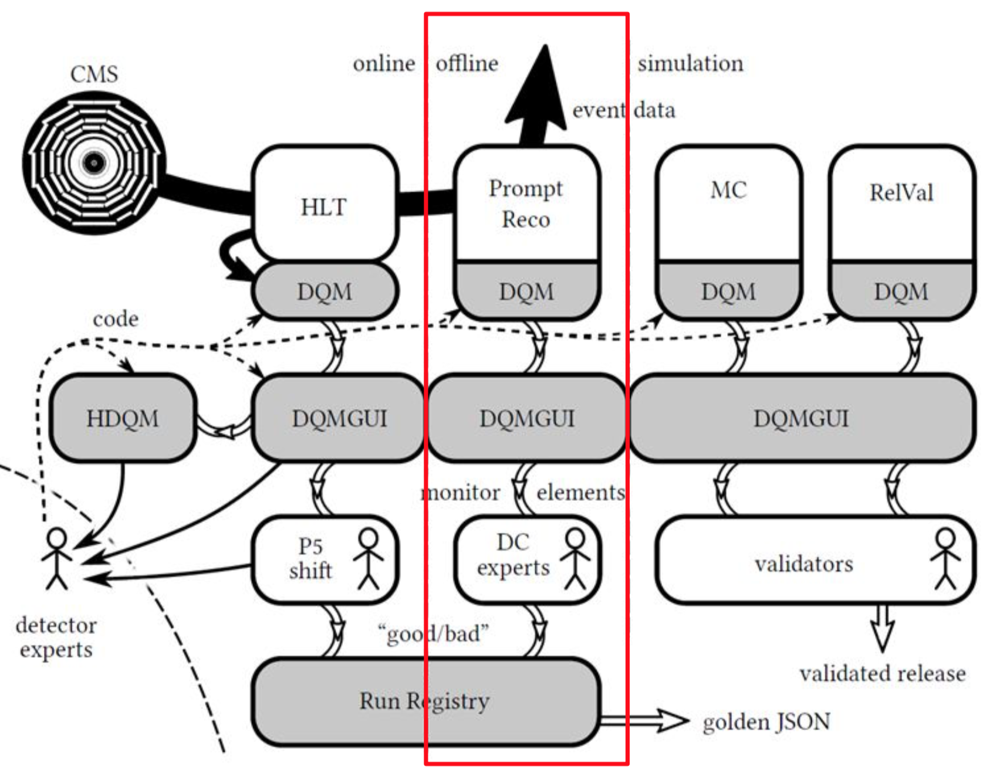
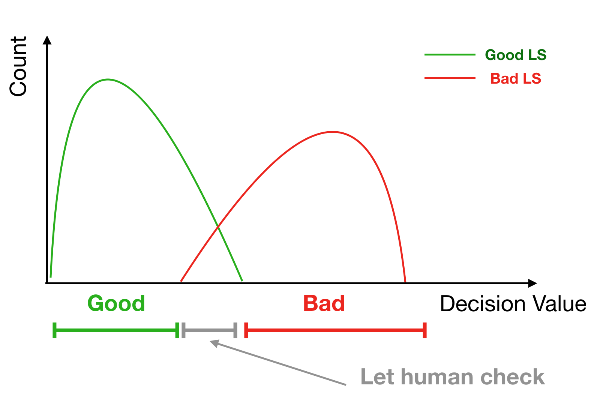
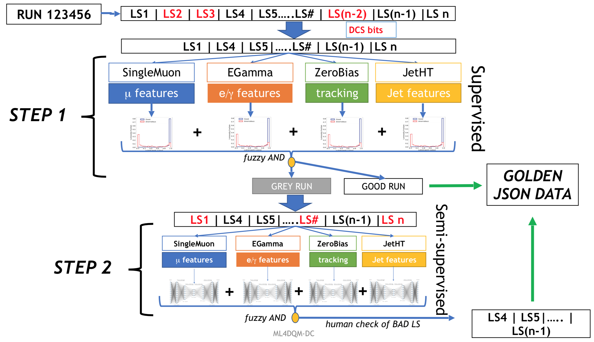

# Outlier Detection for Data Certification 

## Data Quality Monitoring (DQM)
Data quality in CMS detector could be monitored via GUI by using the tools that provided by DQM team. The pipeline of data flow start at online section which shifters at P5 monitor various measured quantity and control the alarming system to directly contact the experts if there is any sub-system went wrong or report the weird behaviour. Not only the online world, DQM tools also provide the offline inspection after 48hrs of collisions to double check the failure of some sub-system by looking multiple histograms.
<p align="center">
    
    <br>
    <em>Tools and Processes of DQM, retrieved from M. Schneider, CHEP 2018</em>
</p>

## Data Granularity in CMS (Offline)
* Reconstruction of physics quantities initiate after 48 hours after collisions
* Offline shiters and detector experts check the dozens of distribution histograms to define goodness of data
* Certification is made on **Run and Lumisection levels**
* Lumisection(LS) is taken around 23 seconds

Ref. [1]

## Criteria for bad LS
1) Automatically filter by DCS bits, beam status and etc. (LS levels)
2) Runs tagged as bad by human (whole run)
3) In rare cases are marked by DC experts (LS levels)

The Golden JSON contains the list of all good LS

## Objective
* **Certify data quality in lumisection granularity**
* Reduce manual work of DC Experts

## Expectation
The key concept of this work is to find a decision value for determining the cutoff which will be use for certify data quality in LS granularity
<p align="center">
    
    <br>
    <em>Three possible regions of prediction</em>
</p>

## Proposal for an alternative approach: two steps
* The automatic DCS bit flagging will stay, ML applied on top of it
* Automatize the Data Certification procedure in two steps
  1) Provide a reliable quality flag per Run using grey-zone approach and Supervised models (artificial BAD data can be used for training)
  2) Use Autoencoders only on the grey-zone with the goal to search for anomalous LS and flag them automatically, human double check at this stage
* Using physical quantities as
  * **features** (pT, eta, etc) and
  * **objects** mapped to the relevant Primary Dataset (i.e tracks to
ZeroBias, muons to SingleMuon ... etc)

  to better mimic the current DC procedure
* This repository will cover only on the second step

<p align="center">
    
    <br>
    <em>Pipeline of data certificaiton that we proposed in this work, retrieved from F. Fiori, ML Applied To Data CertificationStatus and Perspective</em>
</p>

Ref. [2]

## Datasets
Please checkout [this direcotry](data/) for full detail of data preparation and the preprocessing.

## Model
In order to detect the outlier LS, we use the semi-supervised learning where feeding only good LS for the training and validate with both good and bad LS later. For the full detail, please checkout [this link](model/).

## Report
There are multiple reports for this study that are listed in this [directory](report/) 

## References
1) M. Stankevicius, Data Quality Monitoring: Offline
2) F. Fiori, ML Applied To Data CertificationStatus and Perspective

# Dependency
In order to execute the script you have to make sure that you already meet all those criteria 
* Python3.6 and dependency you have is exactly (or simialr) to [this specific libraly](requirement.txt)
* Every script has been designed for execute only in the main directory of this repository which basically you could only run ["main.py"](main.py) or ["unit_test.py"](unit_test.py) to get the result

# IBM's Minsky Cluster
<p align="right">
    
    
</p>
In order to speed up the training process, we are using the GPU resources from IBM in collaboration with CERN Openlab for parallelize a parallalizable task especially for autoencoder algorithm.

Please note that for the general ML approch (no neural network), it would not significantly speed up the algorithm since it doesn't design for GPU executable.

Minsky cluster consists of 4 nodes of GPU (each node contains 4 NVIDIA Tesla P100-SXM2-16GB) and a single CPU node called "ibmminsky-n" and "ibmminsky-head" sequentially. These machine provide an optimized environment configuration which we highly recommend to use their preinstalled conda virtual-environment as the following step.

Here are the step to use this machine and running the example script (In the following step, we are using only one node of GPU machine because one of them contains 4 Tesla GPU which more than we need for this work already)

1) Make sure that you already got an access (please contact cms-PPD-conveners-DQM-DC@cern.ch in case you need it and include a short description of your use case) and connection for the machine is only possible from cern net
2) Remote access to one of GPU machine
    ```console
    [yourusername@lxplusxxx ~]$ ssh yourusername@ibmminsky-1
    ```
3) If your terminal is still unauthenticated which will looks like
    ```console
    -bash-4.2$ 
    ```
    Instead of 
    ```console
    [yourusername@ibmminsky-1 ~]$ 
    ```
    Please execute the below command to reauthenticate your session
    ```console
    -bash-4.2$ k5reauth
    ```
4) Configure the PowerAI envorinment
    ```console
    [yourusername@ibmminsky-1 ~]$ source /opt/anaconda3/etc/profile.d/conda.sh
    ```
5) Activate preinstalled conda virtual environment
    * Python2.7
        ```console
        [yourusername@ibmminsky-1 ~]$ conda activate dlipy2
        ```
    * Python3.6 (In this work we use Python3.6)
        ```console
        [yourusername@ibmminsky-1 ~]$ conda activate dlipy3
        ```
6) (Optional) Deactivate the conda environment
    ```console
    (dlipy3) [yourusername@ibmminsky-1 ~]$ conda deactivate
    ```

## Running the example script
After you already activate the environment, we could try to run the example script to train an autoencoder with PromptReco 2018 datasets as 

1) Clone the repository
    ```console
    (dlipy3) [yourusername@ibmminsky-1 ~]$ git clone https://github.com/calzonelover/CMS_DC_ANOMALY.git
    ```

2) Access to the directory
    ```console
    (dlipy3) [yourusername@ibmminsky-1 ~]$ cd CMS_DC_ANOMALY
    ```
3) Running the script 
    ```console
    (dlipy3) [yourusername@ibmminsky-1 ~]$ python example.py
    ```
    Please note that it might takes a few hour to finish. By the way, we could see each model is running and finishing on the terminal as well.
    
    There log file of the training process would be divide into two parts.
    
    * **Loss value** over the training process between training and validation in each epoch in the directory (report/reco/logs/)
    * **Receiver operating characteristic (ROC)** from decision values located in (report/reco/eval/)

## (Optional) Running the model in background
There is a way to running your model nightly without opening your terminal, I'm using nohup to take care the running process since it's easy to use and lightweight.

```console
(dlipy3) [yourusername@ibmminsky-1 ~]$ nohup python example.py > training.log &
```

Checking the running process by execute the following command

```console
(dlipy3) [yourusername@ibmminsky-1 ~]$ ps aux | grep yourusername
```

## Acknowledgement
* CERN Summer Student program 2019
* Especially
  * **Marcel Andre Schneider**
  * Francesco Fiori
  * Kaori Maeshima
  * Javier Fernandez
  * Adrian Alan Pol
  * Countless CMS DQM people :)
* GPU resources from IBM in collaboration with CERN Openlab