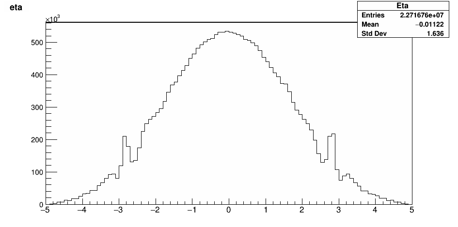

# Folder Description
Each directory contain different interested data
* **[express](express/)** is the occupancy map
* **[prompt_reco](prompt_reco/)** contain PromptReco data from 2016 (only JetHT)
* **[new_prompt_reco](new_prompt_reco/)** consists of PromptReco data from 2018 (JetHT, EGamma, ZeroBias and SingleMuon)

# Offline (PromptReco)
* pp collisions (Separately study 2016 and 2018 data)
* 4 different primary datasets: ZeroBias, JetHT, EGamma, SingleMuon
* Each lumisection (datapoint) contains
  * n histogram of physics quantity e.g. JetPt, JetEta, JetPhi, etc.
  * Represent one histogram with 7 numbers
  * n x 7 Features
* Good LS defined in Golden JSON else Bad LS

## Histogram representation
* Collection of physics objects e.g. photons, muons and so on
* Measurement quantity: Transverse momentum, eta, phi,
etc.
* For full detail of selected features could be found in "features_x.py"

    
     
    <em>Example histogram of Eta distribution</em>

1) Quantize [10%, 30%, 50%, 70%, 90%] of the histogram (For 2016 data, we quantize [0%, 25%, 50%, 75%, 100%] of the histogram)
2) Combine mean and rms
3) Use these **7 values to
represent one histogram**

## Data preprocessing
* **MinMaxScalar** Transformation
* Consider Lumisection i and Feature j

* Then our datapoint should be in range [0, 1]

## Datasets

### 2016 PromptReco
* Located in [this directory](prompt_reco/)
* Available only for JetHT
* LS definition
  * Good LS defined in Golden JSON
  * Bad LS came from DCS bits, bad run from tagged
* [Settings](prompt_reco/setting.py)

### 2018 PromptReco
* Located in [this directory](new_prompt_reco/)
* LS definition
  * Good LS defined in Golden JSON
  * Bad LS came from LS that marked by DC experts and [failure scenario](https://twiki.cern.ch/twiki/bin/viewauth/CMS/ML4DQM#Failure_scenarios_studies)
* [Settings](new_prompt_reco/setting.py)

# Online (Express)
Occupancy in the detector of CMS sub-detector in some interval of few a few LS
## Datasets
<!-- ### 2016 Express -->
### 2017 Express
* Located in [this directory](express_2017/)
* ReReco
* [Settings](express_2017/setting.py)