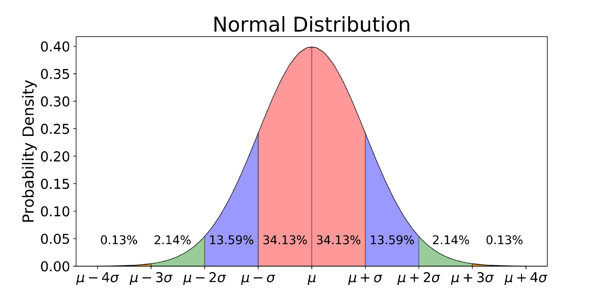
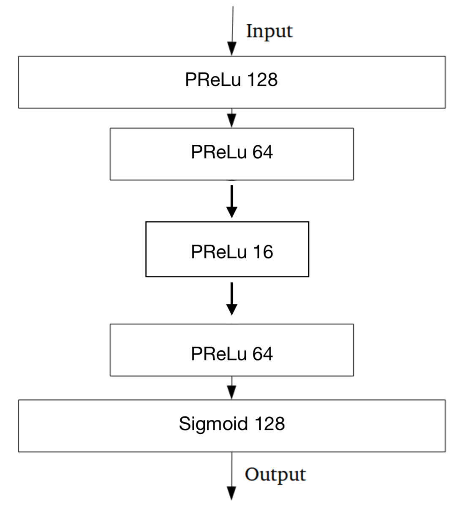
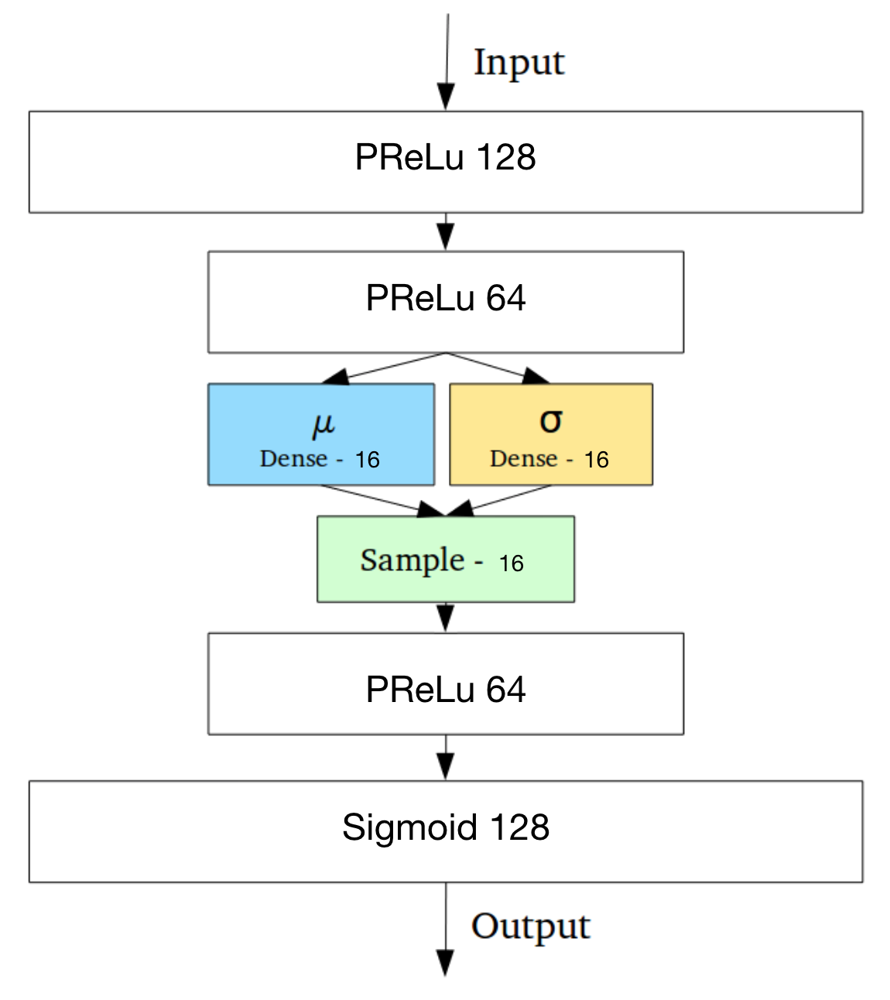
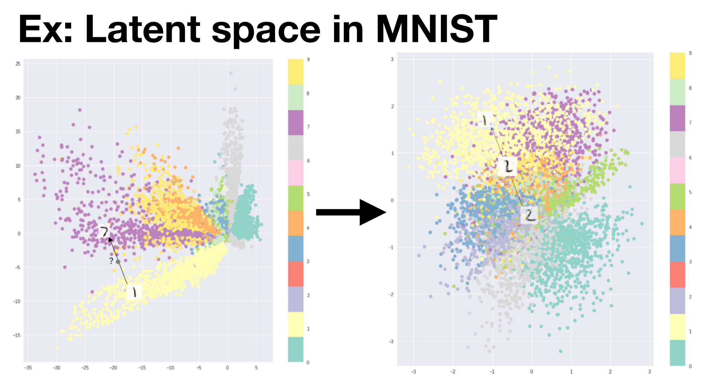
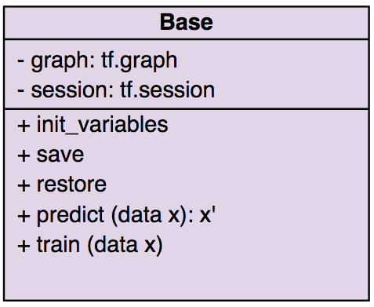

# Semi-supervised Learning (PromptReco)
* Unsupervised Models
  * Schölkopf's One-Class SVM
  * Isolation Forest
  * 4 Flavours of Autoencoder
* Feed only good LS for train and validate the model
* Testing with good LS and bad LS
* Consequently, it’s falling into **Semi-supervised Learning** category

## Autoencoder (AE)
* Truncated normal initializer
    
    For model weight initializer, we are using truncated normal initializer which basically you take a gaussian distribution and putting the cutoff only inside  to prevent some high absolute value that might leading to divergence of model in the training process.

    In our case, we set up  and 

    <p align="center">
    
    <br>
    <em>Gaussian distribution, retrieved from https://towardsdatascience.com/understanding-the-68-95-99-7-rule-for-a-normal-distribution-b7b7cbf760c2</em>
    </p>

* Adam optimizer

    Adam stands for **adaptive moment estimation**. Basically, it's combine Momentum optimization and RMSProp to keep the residue of the gradients decaying from the previous update.

    With configuration:  (learning rate),  and 

    Ref: Adam: A Method for Stochastic Optimization, D. Kingma, J. Ba (2015)

### Vanilla AE
<p align="center">
    
    <br>
    <em>Body of Vanilla AE</em>
</p>

* Concise the information into small latent space and reconstruct
* Loss function is defined by
<p align="center">

</p>

### Sparse AE
* Tweak by L1 Regularizaion (Prevent overfitting)
* Loss function
<p align="center">

</p>

* where 
<p align="center">

</p>

### Contractive AE
* Tweak by Jacobi Matrix (Prevent variation in dataset)
* Loss function
<p align="center">

</p>

* where 
<p align="center">

</p>

* Definition of Jacobi matrix 
<p align="center">

</p>

* Activation function in our case
  
  * PReLu activation function
    <p align="center">
    
    </p>

    where  is the pivot components on the negative side which is inside the body of PReLu activation function itself
  * Sigmoid activation function
    <p align="center">
    
    </p>

    For sigmoid, there is no component inside the activation function. Then it's simpler to represent  as the output of an activation funciton

Ref: Rifai, Salah et al. “Contractive Auto-Encoders: Explicit Invariance During Feature Extraction.” ICML (2011)

### Variational AE
<p align="center">
    
    <br>
    <em>Body of Variational AE , Image revised from https://towardsdatascience.com/intuitively-understanding-variational-autoencoders-1bfe67eb5daf </em>
</p>

* Random “new sampling” in latent space by gaussian random generator
<p align="center">

</p>

* Tweak by reduce discontinuity in latent space
* Loss function
  
<p align="center">

</p>

* Explicit example of removing discontinuity in latent space
<p align="center">
    
    <br>
    <em>Latent space of MNIST before and after applying the technique , Image revised from https://towardsdatascience.com/intuitively-understanding-variational-autoencoders-1bfe67eb5daf </em>
</p>

* Since we represent latent space by applying gaussian. Kullback-Leibler Divergence term would looks like
  <p align="center">
  
  </p>
  In order to minimize the KL-div's term, the model have to adapt it's origin of random sampling toward nearly the origin of the latent space and have to adapt a standata deviation to unity to minimize this term. In principle, outlier would located quite far from the origin and might eventually not sitting around the dense cluster of inlier.

* Then total loss function would looks like
<p align="center">

</p>

Ref:
- Kingma and Welling,  Auto-Encoding Variational Bayes. arXiv:1312.6114.
- Hinton G, Salakhutdinov R. Reducing the Dimensionality of Data with Neural Networks. Science. 2006;313(5786):504–507. Available from: https://www.cs.toronto.edu/~hinton/science.pdf.

### Mother Class for various AE inheritance
Since we are using Tensorflow(v1.13), the concept of abstract graph connection and session execution require a comprehension to maximize the profit of parallelizable task.

Generally, we could have a single graph and session for the model as a global session and global graph connection with all variables you have. In case you have multiple model, it's likely that we want an isolate graph and session for various model execution to make sure that it doesn't share the same variable. That is why we need OOP concept to take care all of those.

The figure below is [the mother class](NN/base.py) of our AE since all the model need their own graph and session as well as other utility function that helps our life easier to have less code and more scalable. 
<p align="center">
    
    <br>
    <em>Main components of the AE's base class</em>
</p>

Not only the main utility function that we could inherit from mother class to have various child class but we could also combine multiple constrains as we want which has been done in the [extended model](../report/reco/new_data/reports/22july2019.pdf) that located in [this script](reco/new_autoencoder.py).

### (Optional) Additional Detail
* **Dynamical GPU memory**
  
  keep in mind that when you declare the graph and execute it by a session then it will allocate the memory on the GPU as much as model could go. Sometimes it could be an overwhelming memory allocation and weird bug about GPU running out of memory would come up on your screen. However, tensorflow also provide the built in solution where it could release and reallocate a memory as much as the session growth as 
    ```python
    self.config = tf.ConfigProto()
    self.config.gpu_options.allow_growth = True
    ```
    and do not forget to combine those configuration with your specific session
    ```python
    self.graph = tf.Graph()
    self.sess = tf.Session(graph=self.graph, config=self.config)
    ```
    By the way, we suspect that this configuration might increase time consumption since it has to allocate the GPU memory and deallocate it back and forth. If the static memory allocation running fine in your process, we strongly suggest to go with a static memory choice.

* **Object deletion** 
    
    Python backend is smart enough to know when each object are no longer used and it will release the memory by delete the object. In order to make sure that not only the memory on local are already released but a memory on the GPU be free as well as session are also perfectly closed. We want to ensure that the session which belonging to this object has been closed by overriding a delete function as
    ```python
    def __del__(self):
        self.sess.close()
        print("object {} deleted".format(self.model_name))
    ```
    It happen during the time when you are executing the program without typing any delete on your script. For more explicit example, You could checkout by running some various model. If some model are no longer use, there will be a message appears like
    ```bash
    object Vanilla_model_JetHT_f2_1 deleted
    ```