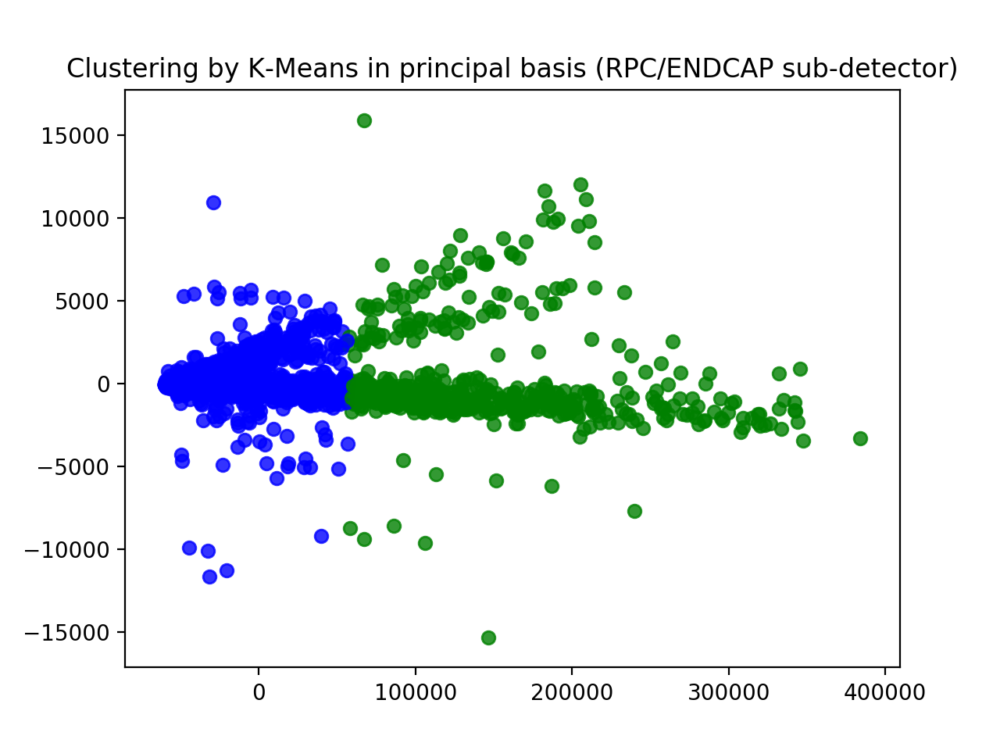
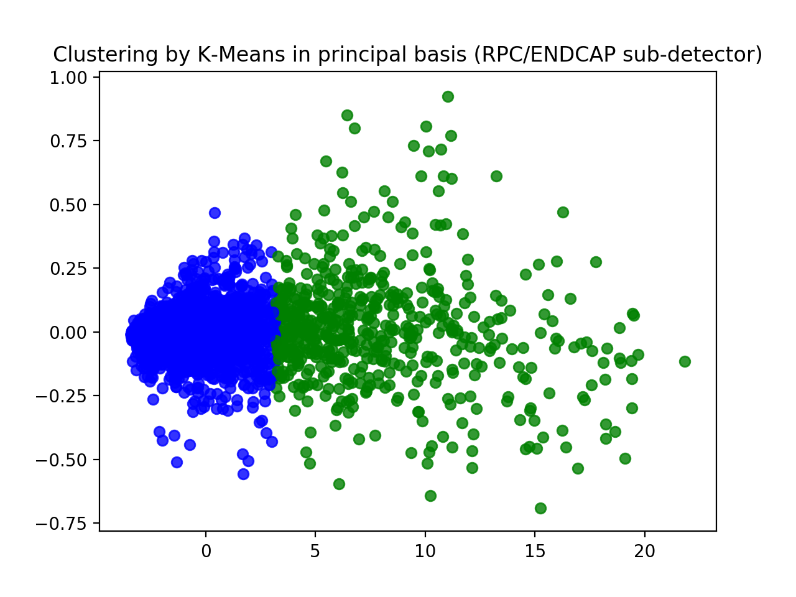
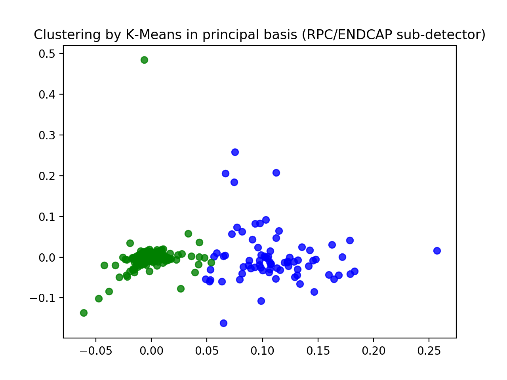

# Report for Express datasets (offline)

## K-Means
### RPC/AllHits/SummaryHistograms/Occupancy_for_Endcap
 * non-preprocess data

 * Standardized data (shifted mean and divide by variance by column)

 * Normalized data (by row)

