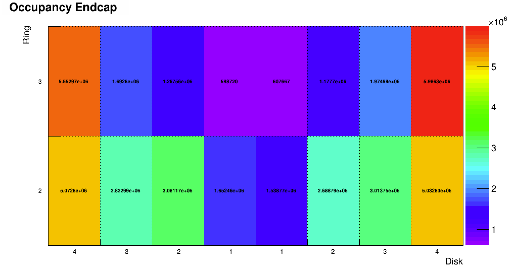

# Report for Express datasets (offline)

## Subdetector: RPC/AllHits/SummaryHistograms/Occupancy_for_Endcap
Regards for 8x5 grid that contains occupancy of events as the example figure below

### K-Means
with fixing N_CLASSES = 2 under assumption of good and poor conditions
 * non-preprocess data

 * Standardized data (shifted mean and divide by variance by column)

 * Normalized data (by row)

